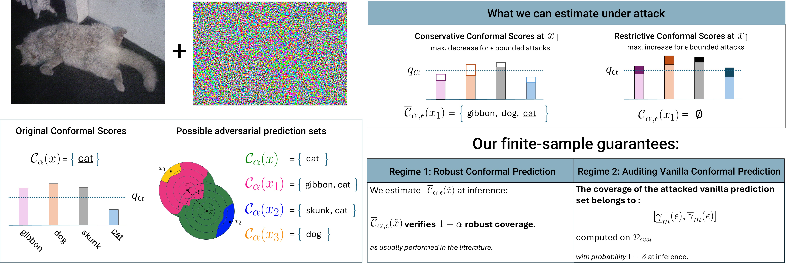
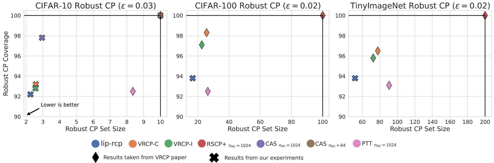
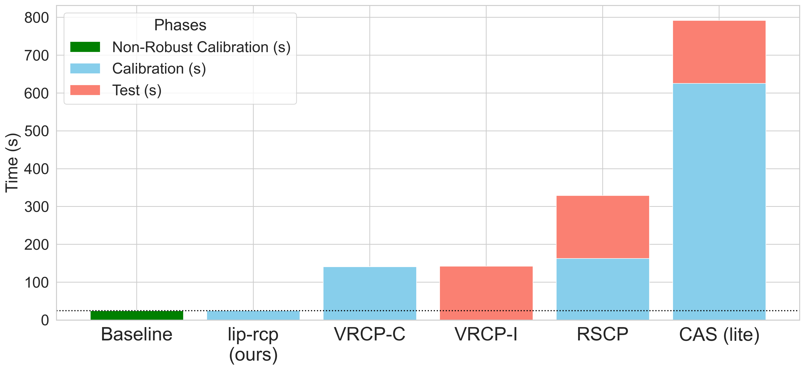
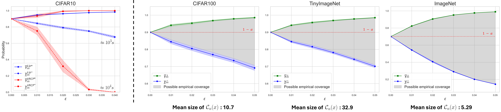

# Efficient Robust Conformal Prediction with Lipschitz-Bounded Networks

*Update: Accepted at ICML 2025.*

### Robustness Guarantees for Split Conformal Prediction

[Link to paper](https://hal.science/hal-04936823/)



We leverage Lipschitz constrained neural networks to efficiently compute Conformal Prediction (CP) sets that certify
correct conformal coverage under adversarial conditions. Our method has the advantage of being efficient, scalable
and compatible with the certification of worst-case coverage variations for vanilla (non-robust) CP.

<h3 align="center">Efficient Robust CP</h3>

<p align="center">
  
</p>
<p align="center"><em>Performance comparison across robust CP methods.</em></p>

<br>

<p align="center">
  
</p>
<p align="center"><em>Runtime comparison across robust CP methods on the CIFAR-10 test set.</em></p>

<br>

<h3 align="center">Vanilla CP Coverage Bounds</h3>

<p align="center">
  
</p>
<p align="center"><em>Coverage guarantees for vanilla CP under bounded perturbations.</em></p>

### Example Notebooks

Robust conformal prediction: [Notebook](notebooks/robust_ps.ipynb) <br />
Worst-case coverage bounds for vanilla CP under adversarial noise: [Notebook](notebooks/coverage_bounds.ipynb) <br />

### Benchmarking scripts

Efficient Robust CP. <br />

```bash

usage: scripts/fast_rcp.py [-h] [--dataset DATASET] [--num_batches NUM_BATCHES] [--on_gpu ON_GPU] 
        [--score_fn SCORE_FN][--alpha ALPHA] [--epsilon EPSILON] [--batch_size BATCH_SIZE]
        [--temp TEMP] [--bias BIAS][--num_iters NUM_ITERS] [--large] [--model_path MODEL_PATH]
```

Vanilla CP Coverage Bounds. <br />

```bash

usage: scripts/vcp_coverage.py [-h] [--alpha ALPHA] [--batch_size BATCH_SIZE] [--bias BIAS] 
        [--delta DELTA] [--epsilon EPSILON] [--temp TEMP] [--n_iters N_ITERS]

```

**Additional work** <br />

We also provide a fast linear programming algorithm to compute the maximum quantile shift under calibration time adversarial attacks. <br />

```bash
usage: scripts/poisoning.py [-h] [--alpha ALPHA] [--bias BIAS] [--temp TEMP] [--epsilon EPSILON]
        [--n_samples N_SAMPLES] [--batch_size BATCH_SIZE]
```

where ```n_samples``` is the number of attacked samples with budget ```epsilon``` in the calibration set for the attack. <br />

### Related works:

| Method | Paper | Code Repository |
|--------|-------|-----------------|
| **RSCP**    | [Paper](https://openreview.net/pdf?id=9L1BsI4wP1H) | [GitHub](https://github.com/Asafgendler/RSCP) |
| **RSCP+**   | [Paper](https://openreview.net/pdf?id=BWAhEjXjeG) | [GitHub](https://github.com/Trustworthy-ML-Lab/Provably-Robust-Conformal-Prediction) |
| **aPRCP**   | [Paper](https://arxiv.org/pdf/2307.16360)          | [GitHub](https://github.com/1995subhankar1995/PRCP) |
| **VRCP**    | [Paper](https://arxiv.org/pdf/2405.18942)          | [GitHub](https://github.com/ddv-lab/Verifiably_Robust_CP) |
| **CAS**     | [Paper](https://arxiv.org/pdf/2407.09165)          | [GitHub](https://github.com/soroushzargar/CAS) |
| **PCP**     | [Paper](https://arxiv.org/pdf/2406.05405)          | [GitHub](https://github.com/Shai128/pcp) |
| **BinCP** (new)  | [Paper](https://arxiv.org/pdf/2503.05239)          | [GitHub](https://github.com/soroushzargar/BinCP) |


### Please consider citing this work :

```
@unpublished{massena:hal-04936823,
  TITLE = {{Efficient Robust Conformal Prediction via Lipschitz-Bounded Networks}},
  AUTHOR = {Massena, Thomas and And{\'e}ol, L{\'e}o and Boissin, Thibaut and Friedrich, Corentin and Mamalet, Franck and Serrurier, Mathieu and Gerchinovitz, S{\'e}bastien},
  URL = {https://hal.science/hal-04936823},
  NOTE = {working paper or preprint},
  YEAR = {2025},
  MONTH = Feb,
  KEYWORDS = {Conformal prediction ; Robustness ; Lipschitz neural network},
  PDF = {https://hal.science/hal-04936823v1/file/_ArXiv__Efficient_Robust_Conformal_Prediction_via_Lipschitz_Bounded_Networks.pdf},
  HAL_ID = {hal-04936823},
  HAL_VERSION = {v1},
}

```

### Acknowledgements:

This work has benefited from the support of the [DEEL](https://www.deel.ai/) project, with fundings from the Agence Nationale de la Recherche, and which is part of the ANITI AI cluster.
